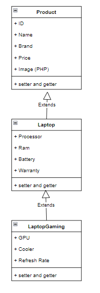

# TP2DPBO2425C1

# Janji
Saya Daffa Dhiyaa Candra dengan NIM 2404286 mengerjakan 
TP 2 dalam mata kuliah Desain dan Pemrograman
Berorientasi Objek untuk keberkahanNya maka saya tidak 
melakukan kecurangan seperti yang telah dispesifikasikan. Aamiin.

# Diagram

# Desain ProgRAM
Program saya terdiri dari 3 kelas

## Kelas Product
Atribut :
 - ID (Kode unik untuk setiap objek)
 - Name (Nama dari objek)
 - Brand (Brand dari objek)
 - Price (Harga dari objek)
 - Image (PHP only)

Method :
Getter dan Setter untuk semua atribut kecuali ID. ID hanya memiliki getter karena ID akan bertambah secara otomatis

## Kelas Laptop
Atribut :
 - Processor (Processor untuk Laptop)
 - RAM (Ukuran RAM untuk Laptop)
 - Battery (Ukuran Baterai untuk Laptop)
 - Warranty (Garansi Untuk Laptop)

Method :
Getter dan Setter untuk semua atribut

## Kelas LaptopGaming
Atribut : 
 - GPU (GPU di Laptop Gaming)
 - Cooler (Cooler di Laptop gaming)
 - Refresh Rate (Refresh Rate di Laptop Gaming)

Method :
Getter dan Setter untuk setiap atribut

# Alur Program
Untuk bahasa C++, Java dan Python, dalam program ada 3 menu yang bisa dipilih oleh user.
[1] Tambah Laptop Gaming
[2] Tampilkan Catalogue
[3] Keluar

1. Untuk menambahkan data, user harus memasukkan 10 atribut yaitu Name, Brand, Price, Processor, RAM, Battery, Warranty, GPU, Cooler, Refresh Rate.
2. Jika user memilih opsi 2, maka program akan menampilkan semua data laptop dengan tabel dinamis sesuai dengan teks terpanjang yang ada di data.
3. Jika user memilih opsi 3, maka program akan selesai dan menampilkan pesan "Exiting program.".

Untuk bahasa PHP, ada 4 fitur yang tersedia
1. User bisa menambahkan Laptop Gaming baru ke katalog dengan memasukkan atribut Name, Brand, Price, Processor, RAM, Battery, Warranty, GPU, Cooler, Refresh Rate, dan Image.
2. User bisa mencari di katalog berdasarkan nama atau brand Laptop Gaming
3. User bisa mengedit data barang yang sudah ada di katalog
4. User bisa menghapus barang yang sudah ada di katalog

# Dokumentasi

# Cpp
 
 
 
 

# Java
 
 
 

# Python
 
 
 

# PHP
 
 
 
 